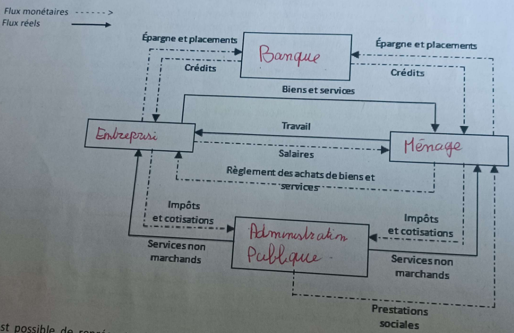

# 👩🏫 Chapitre 1

Les agents économiques sont regroupés en catégories pour pouvoir faciliter l'analyse de leurs échanges car il existe une multitude d'acteurs économiques en relation les uns avec les autres. De plus, chaque agent économique a des fonctions dans l'activité économique.&#x20;

Un agent économique est un individu ou groupe d'individus qui prend des décisions qui influencent l'économie  Ils sont regroupés selon leur fonction économique.

\- les <mark style="color:blue;">**ménages**</mark> constitués des occupants d'un même logement (qu'il y ait entre eux un lien de parenté ou non). Exemples : des étudiants en colocation, un célibataire, un couple avec trois enfants.\
\- les <mark style="color:blue;">**entreprises**</mark> qui assurent la production de biens et services pour les vendre afin de réaliser des <mark style="color:blue;">bénéfices</mark> . Exemples : Renault, Kiabi, L'Oréal.\
\- les <mark style="color:blue;">**banques**</mark> qui sont des organisations qui commercialisant des produits et services financiers. Exemples : Société Générale, Crédit Agricole, Banque Populaire. \
\- les <mark style="color:blue;">**administrations publique**</mark> qui sont des organismes publics qui proposent des services non marchands pour répondre aux besoins d'intérêt général de la population (ordre public, services publics. Elles comprennent les administrations centrales (État, Ministères) et les administrations locales (collectivités territoriales) et les administrations de sécurité sociale (Hôpitaux publics, Sécurité sociale, CAF).&#x20;

Les <mark style="color:blue;">**ménages**</mark> ont pour fonction économique principale la consommation de bien et service.\
Les <mark style="color:blue;">**entreprises**</mark> ont pour fonction économique principale la production de bien et services marchand .\
Les <mark style="color:blue;">**banques**</mark> assurent principalement le financement par la collecte et le prêt de fonds (crédit). En effet, elles reçoivent des dépôts des agents économiques et accordent des prêts à ces derniers. \
Les <mark style="color:blue;">**administrations publiques**</mark> ont pour fonction production non marchande destinée à la collectivité. La production non-marchande est proposée gratuitement ou à un prix inférieur à son coût de production (crèches, éclairage public...).

Les échanges entre les agents économiques peuvent être représentés de façon schématique et simplifiée sous forme de <mark style="color:blue;">**circuit économique**</mark>. Il représente les relations essentielles entre les agents économiques et donne une idée des flux qui circulent entre eux.

<figure><figcaption></figcaption></figure>
