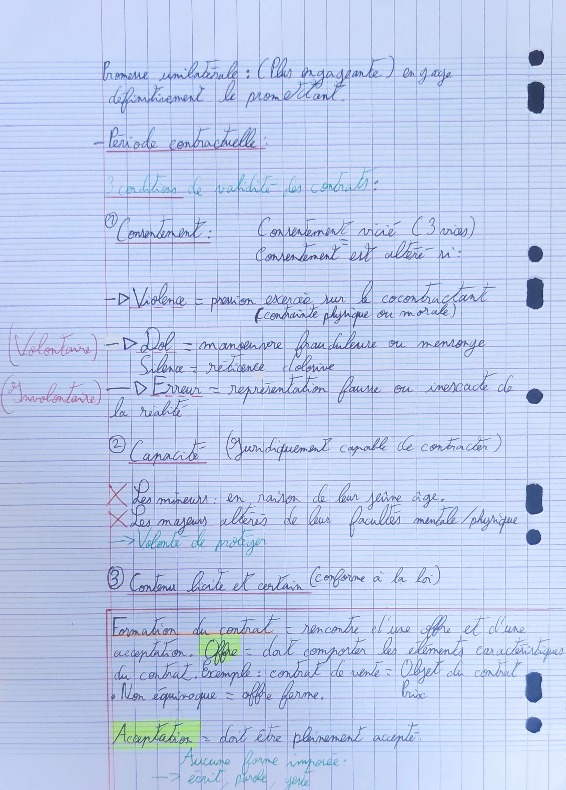

# 👩🏫 Chapitre 3

<mark style="color:blue;">**Contrat**</mark> : accord de volonté entre deux ou plusieurs personnes appelées "Parties" destiné à créer des obligations. Repose sur le principe de liberté contractuelle, chacun est libre de : \
\- De conclure ou non le contrat.\
\- De choisir son cocontractant.\
\- De définir le contenu sous réserve de respect de l'ordre public (article 6 du Code civil) et des lois qui s'imposent directement aux contractants.\
\- De déterminer la forme du contrat.

### **Période précontractuelle :** Négociations =

**Pourparlers :** Temps pendant lequel des informations vont être communiqués et les négociations menées. ⚠️ Aucun obligation de contracter au terme des pourparlers mais il y a 3 règles: \
\- <mark style="color:red;">**Bonne foi**</mark> (comportement légal avec le co-contractant, le contractant ne doit pas nuire à son co-contractants)\
\- <mark style="color:red;">**L'obligation d'information**</mark>, communiquer les informations qui sont importantes, notamment celle portant sur le contenu du contrat.\
\- <mark style="color:red;">**Obligation de confidentialité**</mark>, les informations communiquées ne peuvent être divulguées à des tiers.\
_<mark style="color:red;">**Sinon : Dommages et intérêts**</mark>_

Après les pourparlers : contrat définitif mais aussi Avant-contrat.

### **Avant - contrats (Préparer la conclusion du contrat) :**

<mark style="color:blue;">**Pacte de préférence**</mark>** ** : Un partie peut ne pas être prête à contracter dans l'immédiat mais apporter des garanties pour l'avenir. (Un partie s'engage à proposer un bien en priorité à une autre partie).\
<mark style="color:blue;">**Promesse synallagmatique**</mark> de contrat qui engage les deux parties.

<figure><figcaption></figcaption></figure>
