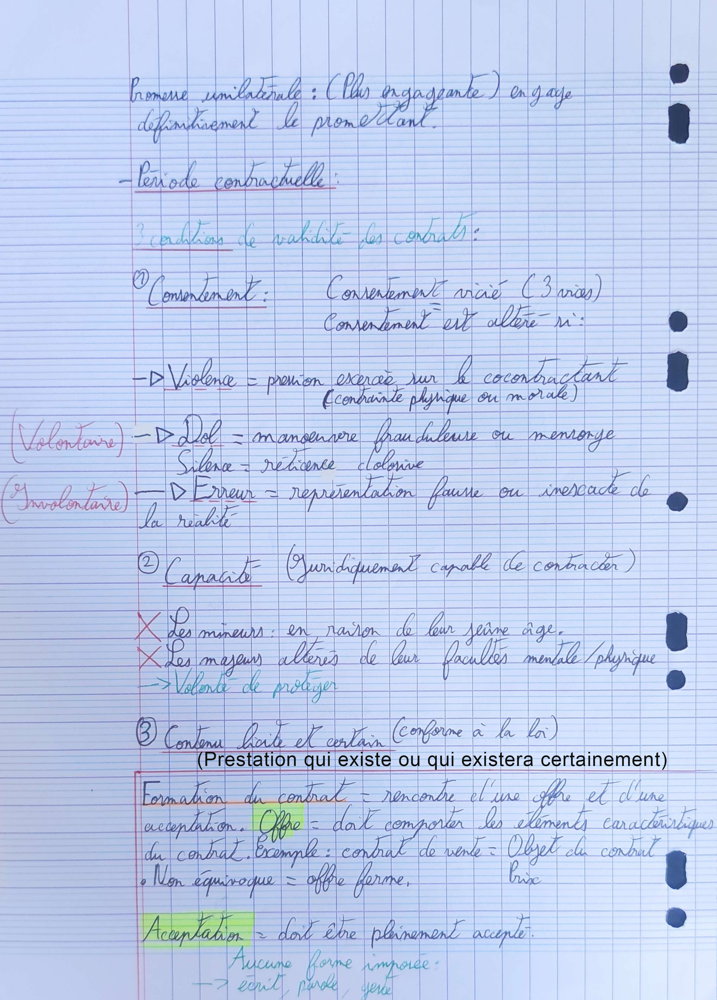

# Synthèse : Le contrat

### **Période précontractuelle :** Négociations =

**Pourparlers :** Temps pendant lequel des informations vont être communiqués et les négociations menées. ⚠️ Aucun obligation de contracter au terme des pourparlers mais il y a 3 règles: \
\- <mark style="color:red;">**Bonne foi**</mark> (comportement légal avec le co-contractant)\
\- <mark style="color:red;">**L'obligation d'information**</mark>, communiquer les informations qui sont importantes, notamment celle portant sur le contenu du contrat.\
\- <mark style="color:red;">**Obligation de confidentialité**</mark>, les informations communiquées ne peuvent être divulguées à des tiers.\
_<mark style="color:red;">**Sinon : Dommages et intérêts**</mark>_

### **Avant - contrats :**

**Pacte de préférence** : Un partie peut ne pas être prête à contracter dans l'immédiat mais apporter des garanties pour l'avenir. (Un partie s'engage à proposer un bien en priorité à une autre partie).

<figure><figcaption></figcaption></figure>
