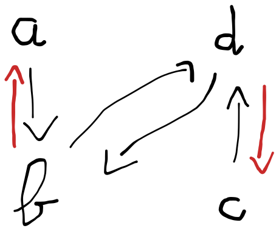

# 🦤 Ensembles

## Définir un Ensemble

On peut définir une ensemble E en :&#x20;

* <mark style="color:green;">**EXTENSION**</mark> avec la liste des éléments :  <mark style="color:green;">E = {0, 1, 2, 3, 4, 5}</mark>
* <mark style="color:green;">**COMPRÉHENSION**</mark> avec une formule de maths : <mark style="color:green;">F = {n</mark> <mark style="color:green;"></mark><mark style="color:green;">**∈**</mark> <mark style="color:green;"></mark><mark style="color:green;">ℕ / n = 2k, k</mark> <mark style="color:green;"></mark><mark style="color:green;">**∈**</mark> <mark style="color:green;"></mark><mark style="color:green;">ℕ} = {2k, k</mark> <mark style="color:green;"></mark><mark style="color:green;">**∈**</mark> <mark style="color:green;"></mark><mark style="color:green;">ℕ}</mark>

Le <mark style="color:green;">**CARDINAL**</mark> est le nombre d'éléments que contient E : <mark style="color:green;">card(E)</mark>

<figure><figcaption></figcaption></figure>


Pour une notation simplifiée sur le site, je représente A barre sous cette forme : ~~<mark style="color:blue;">**A**</mark>~~\
\
A \ B = A **∩ **~~**B**~~\
~~~~A Δ B = (A **∪** B) \ (A **∩** B)\
A Δ B = (A **∪** B) **∩ **~~**(A ∩ B)**~~\
~~****~~A Δ B = (A **∪** B) **∩** (~~**A**~~ ∪ ~~**B**~~)


## Produit Cartésien

<figure><figcaption></figcaption></figure>

E = {a; b}\
F = {1; 2; 3}\
\
ExF = { {a; 1} ; {a; 2} ; {a; 3} ; {b; 1} ; {b; 2} ; {b; 3} ; {c; 1} ; {c; 2} ; {c; 3} }

## Relations binaires


<mark style="color:green;">Réflexive</mark> = tous les points doivent être reliés avec eux même



<mark style="color:green;">Symétrique</mark> =  si le point <mark style="color:blue;">a</mark> est relié au point <mark style="color:red;">b</mark>, c'est équivalent à ce que le point <mark style="color:red;">b</mark> soit relié au point <mark style="color:blue;">a</mark>



<mark style="color:green;">Antisymétrique</mark> =



<mark style="color:green;">Transitive</mark> = si le point <mark style="color:blue;">a</mark> est relié au point <mark style="color:red;">b</mark> et que le point <mark style="color:red;">b</mark> est relié au point <mark style="color:yellow;">c</mark>, ça **implique** que le point <mark style="color:blue;">a</mark> est relié au point <mark style="color:yellow;">c</mark>


## Injection - Surjection


<mark style="color:green;">Injective</mark> = quand les images possèdent **maximum 1 antécédent** (interdiction d'avoir plusieurs antécédents)



<mark style="color:green;">Surjective</mark> = quand toutes les images sont reliées à un antécédent



<mark style="color:green;">Bijective</mark> = Injective + Surjective (donc **chaque image** possède **1 antécédent)**

