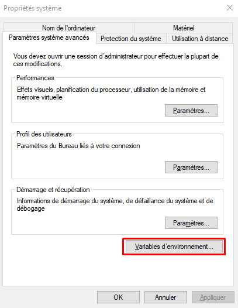
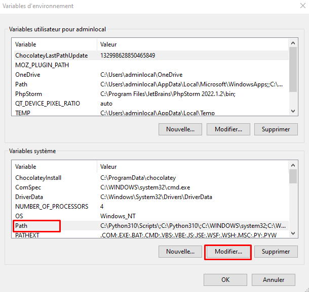
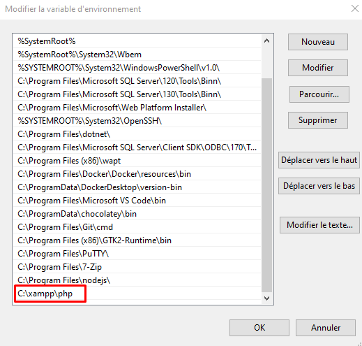

# MVC



MVC proposé par Valentin Brosseau ([https://cours.brosseau.ovh/](https://cours.brosseau.ovh/))


Il est possible de lancer un serveur Web en local:

```shell
# Windows (avec XAMPP)
C:/xampp/php/php -S localhost:9000

# Windows (avec WAMP)
C:/wamp64/bin/php/php7.4.9/php -S localhost:9000

# Linux / OSX
php -S localhost:9000
```

### Configurer le PC pour une commande simplifiée

**Commande simplifiée**

```shell
php
php mvc serve
```

Recherchez les variables d'environnement dans la barre de recherche Windows

<figure><figcaption></figcaption></figure>

Modifier les variables d'environnement

<figure><figcaption></figcaption></figure>

Modifier la variable Path

<figure><figcaption></figcaption></figure>

Ajouter la variable PHP

<figure><figcaption></figcaption></figure>

## Création Model & Controller

```shell
#Création d'un Model
C:\xampp\php\php mvc model:create NomModel

#Création d'un Controller
C:\xampp\php\php mvc controller:create NomController
```
